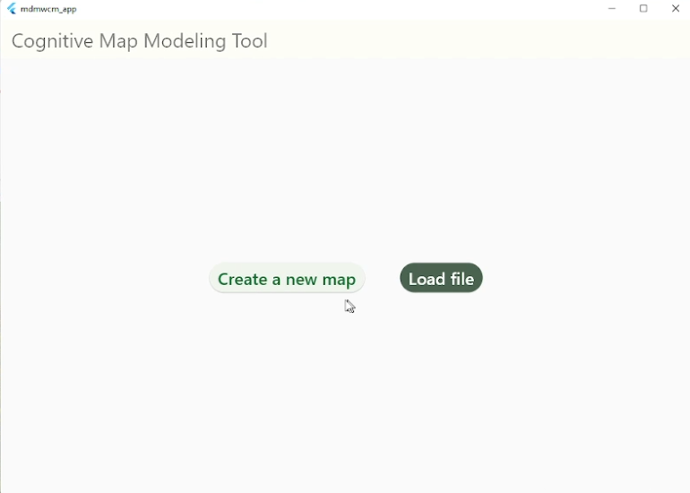
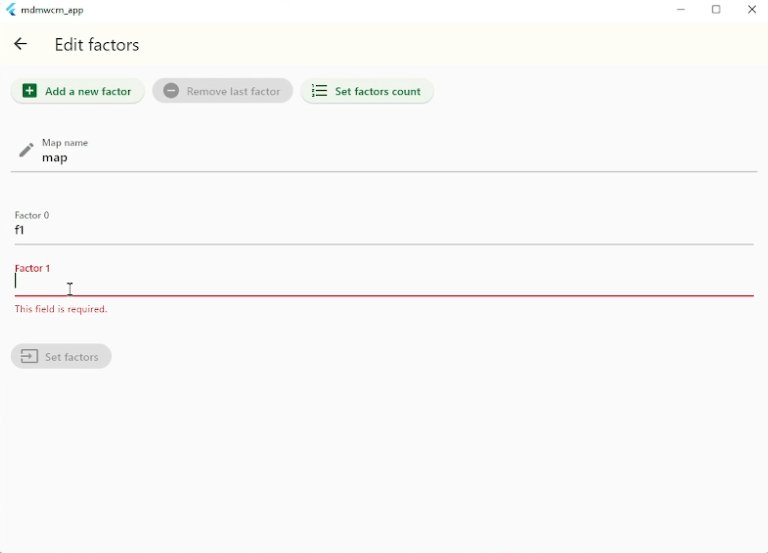
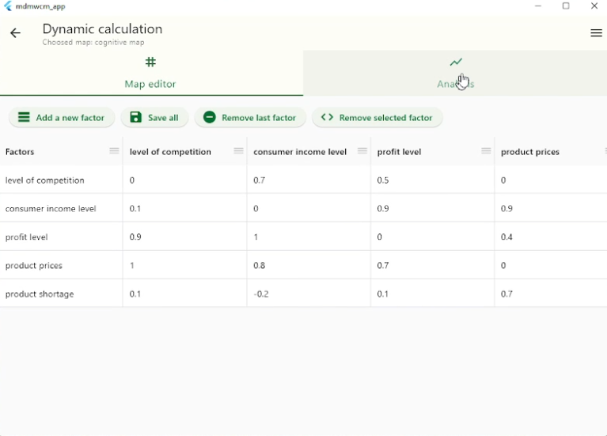
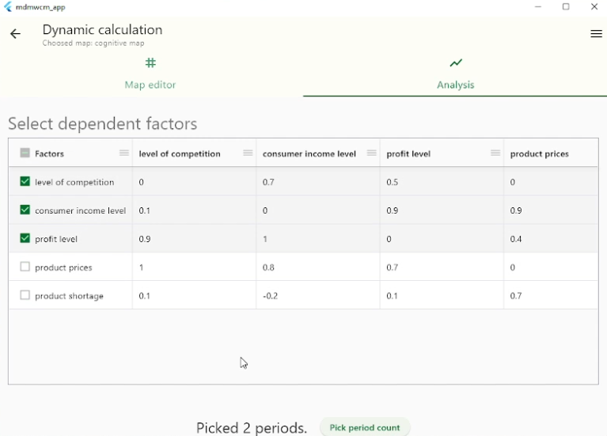
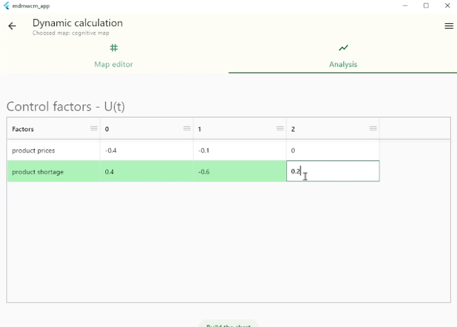
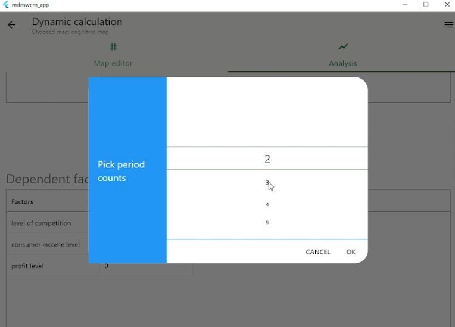
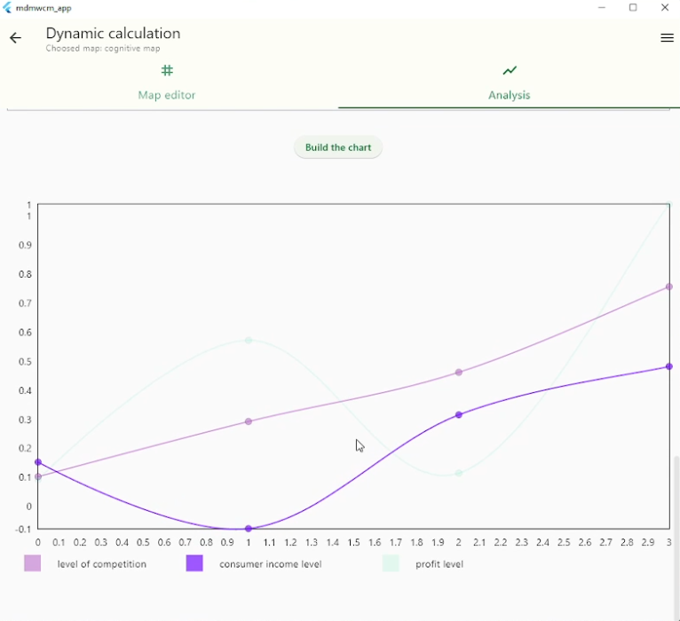

# modeling data management with cognitive maps (mdmwcm_app)

This is a small MVP project to develop a tool for modeling cognitive maps, which is implemented as a desktop application.

## Domain Information

Cognitive modeling based on cognitive maps makes it possible to use incomplete, fuzzy and even contradictory information from subject matter experts on a complex object of study to control it. Cognitive maps are used to determine the most significant and significant relationships, identify factors that significantly affect the problem under study, as well as signs of a control action of the required size, shape and sign of application in order to obtain the desired results.

## Used stack

- [GetX](https://pub.dev/packages/get): Easy and powerful state management framework with useful UI tricks;
- [pluto_grid](https://pluto.weblaze.dev/series/pluto-grid): for work with data grids;
- [fl_chart](https://github.com/imaNNeo/fl_chart): Flutter chart library;
- Others package for UI and utils: flutter_material_pickers, file_saver, file_picker, equations, e.t.c. 

## Features
### 
- [x] create new cognitive map;
- [x] edit cognitive map's weights in matrix form;
- [x] add/delete factors;
- [x] data validation;
- [x] save map to file;
- [x] load cognintive map from file;
- [x] analysis of dynamics cognitive map;
- [x] show chart. 

## Ways of improving

- [ ] subtract/sum cognitive maps;
- [ ] edit cognitive map's weights in graph form;
- [ ] save to file also analysis' result;
- [ ] redisign UI.

## App demonstration

\
Img - Start
\
\

\
Img - Set factors (create new map)
\
\

\
Img - Cognitive map edit
\
\

\
Img - Cognitive map choose dependent factors
\
\

\
Img - Cognitive map set controlled factors
\
\

\
Img - Cognitive map choose time
\
\
.png)
\
Img - Cognitive map set S(0)
\
\

\
Img - analysis chart

## Author contacts

Made by @yokawaiik

  
  
  
  

## License

GPL